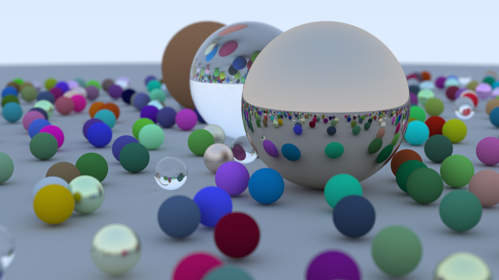
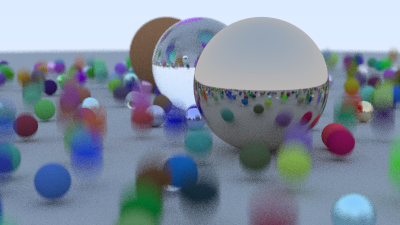
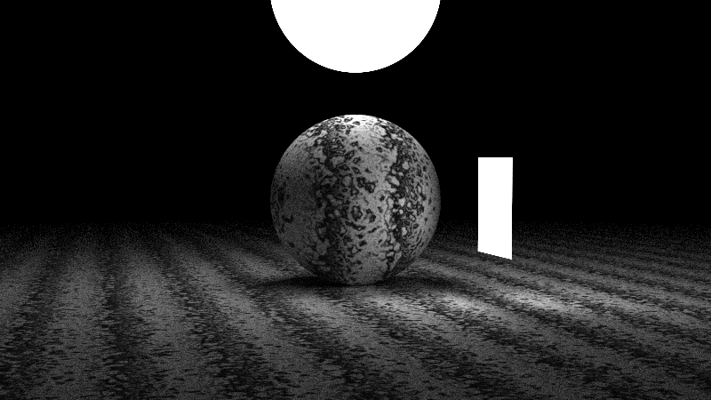
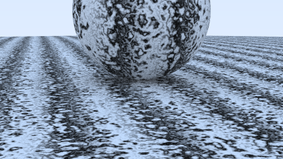

# raytracing_in-one-week
An implementation of a ray tracing renderer
## 示例场景

  
  <figcaption>不同材质的球</figcaption>

  
  <figcaption>运动模糊</figcaption>

  
  <figcaption>发光物体</figcaption>

  
  <figcaption>柏林噪声</figcaption>

